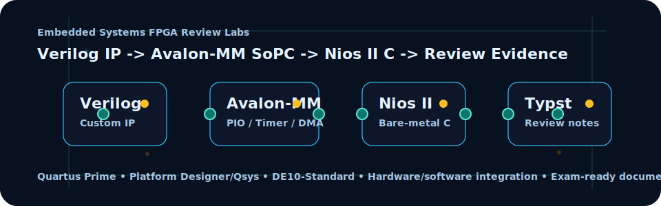
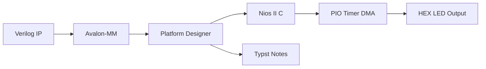

# ⚡ Lab Ôn Tập Hệ Thống Nhúng FPGA/SoPC

  

  
  
  
  
  

  <b>Bộ lab ôn tập Hệ thống nhúng</b> được đóng gói lại thành portfolio kỹ thuật: Quartus, Platform Designer/Qsys, Verilog custom IP, Avalon-MM, Nios II C, PIO, timer, DMA và tài liệu Typst để người đọc thấy được toàn bộ luồng phần cứng/phần mềm.

---

## 🧭 Repo này chứng minh điều gì?

| Năng lực | Bằng chứng trong repo | Giá trị khi HR/kỹ sư đọc |
| --- | --- | --- |
| Thiết kế FPGA/SoPC | Project Quartus, `.qsys`, wrapper Verilog và cấu trúc Platform Designer | Hiểu cách xây hệ thống trên FPGA thay vì chỉ viết module rời |
| Tích hợp bus Avalon-MM | Custom IP, PIO, timer, DMA, thanh ghi và memory-mapped I/O | Có tư duy giao tiếp phần cứng/phần mềm |
| Firmware Nios II C | `IORD`, `IOWR`, timer interrupt, điều khiển LED 7 đoạn | Biết điều khiển ngoại vi từ C trên SoPC |
| Tài liệu hóa kỹ thuật | Source Typst và PDF ôn tập | Có khả năng biến lab thành tài liệu có thể đọc, học và đánh giá |
| Đóng gói portfolio | README, release, tag, topics và mô tả repo | Repo có tín hiệu chuyên nghiệp hơn một thư mục nộp bài thô |

## 📂 Bản đồ thư mục

| Đường dẫn | Vai trò |
| --- | --- |
| `de1/` | Bài thực hành đồng hồ số, PIO, switch và LED 7 đoạn, có firmware C đi kèm |
| `de2/` | Thiết kế đồng hồ mở rộng với custom register, key reader, switch input và HEX output |
| `Bai7/` | Lab timer/custom HEX IP, Nios II, Avalon-MM và hiển thị sáu HEX |
| `Bai8_new/` | Lab DMA với bộ nhớ on-chip, luồng truyền dữ liệu và firmware Nios II |
| `DeCuongOnTap_HTNhung/` | Source Typst cho đề cương ôn tập Hệ thống nhúng |
| `DeCuong_OnTap_LuongHaiLong.pdf` | Bản PDF xuất ra để học, nộp và đối chiếu |

## 🔩 Pipeline kỹ thuật

## 🧪 Điểm đáng xem trong mã

| Nhóm | File/thư mục | Nội dung nổi bật |
| --- | --- | --- |
| Verilog IP | `de2/*.v`, `Bai7/*.v`, `Bai8_new/*.v` | Thanh ghi, đọc phím, đọc switch, điều khiển HEX và wrapper hệ thống |
| Qsys/Platform Designer | `system.qsys`, `system.sopcinfo` | Cấu hình SoPC, bus, ngoại vi và hệ thống Nios II |
| Firmware | `Software/**/source.c`, `hello_world.c` | Truy cập thanh ghi bằng C, điều khiển hiển thị, timer và DMA |
| Tài liệu | `DeCuongOnTap_HTNhung/src/*.typ` | Ghi chú có cấu trúc về master/bus/slave, SoPC flow và nội dung ôn tập |

## 🛠️ Cách dựng lại

| Bước | Thao tác |
| --- | --- |
| 1 | Mở project tương ứng trong Intel Quartus Prime |
| 2 | Kiểm tra hoặc regenerate thiết kế trong Platform Designer/Qsys |
| 3 | Build lại project Quartus và tạo output local |
| 4 | Regenerate BSP cho Nios II theo hệ thống phần cứng hiện tại |
| 5 | Build firmware trong thư mục `Software/` tương ứng |
| 6 | Nạp lên board, kiểm tra switch/key/timer/DMA/HEX theo từng bài |

Các thư mục build sinh ra như `db/`, `incremental_db/`, `output_files/`, BSP output, bitstream và cache toolchain không nên đưa vào Git nếu không cần thiết cho release.

## 🏷️ Metadata đề xuất

| Nhóm | Nội dung |
| --- | --- |
| Mô tả repo | Bộ lab ôn tập FPGA/SoPC: Quartus, Platform Designer, Verilog Avalon-MM IP, Nios II C, PIO, timer, DMA và ghi chú Typst cho Hệ thống nhúng. |
| Topics | `fpga`, `verilog`, `embedded-systems`, `sopc`, `avalon-mm`, `nios-ii`, `intel-quartus`, `platform-designer`, `de10-standard`, `embedded-c`, `timer`, `dma`, `digital-design`, `typst`, `electronics-engineering` |
| Release | Release mới nhất ghi lại phiên bản portfolio đã có README tiếng Việt, visual, hướng dựng lại, tag và topics đầy đủ |

## 👤 Tác giả

| Trường | Thông tin |
| --- | --- |
| Họ tên | **Lương Hải Long** |
| Ngành | Điện tử Viễn thông |
| Trọng tâm | FPGA/SoC, Verilog, C/C++, Python, hệ thống nhúng, AI, Kaggle, IPYNB |
| GitHub | [github.com/lhlizdabezt](https://github.com/lhlizdabezt) |
| LinkedIn | [linkedin.com/in/lhlizdabezt](https://www.linkedin.com/in/lhlizdabezt) |
| Portfolio | [Hồ sơ GitHub kỹ thuật](https://github.com/lhlizdabezt/lhlizdabezt) |

## 📌 Ghi chú học thuật

Repo này phục vụ ôn tập, lưu trữ bài thực hành và trình bày năng lực kỹ thuật. Source và tài liệu được giữ lại để truy vết quá trình học, không thay thế tài liệu chính thức của môn học hoặc yêu cầu của giảng viên.
