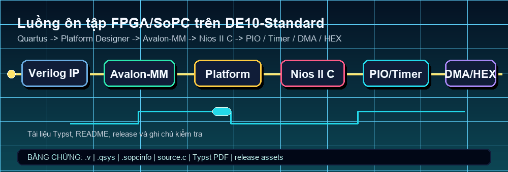
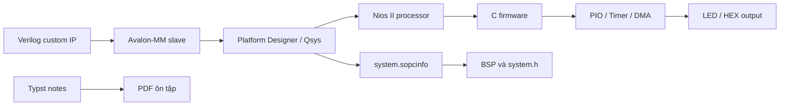

# ⚡ Lab ôn tập Hệ thống nhúng FPGA/SoPC

  

  

  
  
  
  
  

Repo này đóng gói lại bộ lab ôn tập **Hệ thống nhúng FPGA/SoPC** theo hướng có thể review nhanh: có project Quartus, Platform Designer/Qsys, Verilog custom IP, Avalon-MM, Nios II C, PIO, timer, DMA, tài liệu Typst và release để người đọc kiểm tra được bằng chứng thay vì chỉ thấy một thư mục nộp bài.

Phạm vi đúng của repo là **lab học thuật và ôn tập kỹ thuật**. Nội dung thể hiện cách tôi đọc, tổ chức và trình bày lại luồng phần cứng/phần mềm trên FPGA; không mô tả đây là sản phẩm thương mại hay hệ thống production.

## Điểm đọc nhanh

| Năng lực cần chứng minh | Bằng chứng trong repo | Giá trị khi HR/kỹ sư đọc |
| --- | --- | --- |
| Thiết kế FPGA/SoPC | `.qpf`, `.qsf`, `.qsys`, wrapper Verilog và file sinh từ Platform Designer | Cho thấy khả năng dựng hệ thống trên FPGA, không chỉ viết module rời |
| Giao tiếp Avalon-MM | Custom IP, PIO, timer, DMA, thanh ghi và memory-mapped I/O | Thể hiện tư duy nối phần cứng với phần mềm |
| Firmware Nios II C | `source.c`, `hello_world.c`, `IORD`, `IOWR`, timer và DMA | Có dấu vết truy cập ngoại vi từ C trên SoPC |
| Tài liệu kỹ thuật | Source Typst và PDF ôn tập | Biết chuyển lab thành tài liệu có cấu trúc, dễ kiểm tra |
| Portfolio GitHub | README, visual tự host, release, tag, topics và source snapshot | Repo có thể mở ra đọc, đánh giá và truy nguồn ngay |

## Bản đồ thư mục

| Đường dẫn | Vai trò |
| --- | --- |
| `de1/` | Lab PIO, switch, LED 7 đoạn và phần mềm Nios II C tương ứng |
| `de2/` | Lab mở rộng với custom register, key reader, switch input và HEX output |
| `Bai7/` | Lab timer/custom HEX IP, Avalon-MM, Nios II và hiển thị sáu HEX |
| `Bai8_new/` | Lab DMA với bộ nhớ on-chip, đường truyền dữ liệu và firmware Nios II |
| `DeCuongOnTap_HTNhung/` | Source Typst cho đề cương ôn tập Hệ thống nhúng |
| `DeCuong_OnTap_LuongHaiLong.pdf` | Bản PDF xuất ra để học, nộp và đối chiếu |
| `assets/` | Visual tự host cho README và profile GitHub |
| `scripts/render_fpga_review_flow.py` | Script dựng lại GIF flow để sửa motion asset có kiểm soát |

## Luồng kỹ thuật

## Bằng chứng trong mã

| Nhóm | File/thư mục | Nội dung đáng xem |
| --- | --- | --- |
| Verilog IP | `de2/*.v`, `Bai7/*.v`, `Bai8_new/*.v` | Thanh ghi, đọc phím, đọc switch, điều khiển HEX và wrapper hệ thống |
| Component metadata | `*_hw.tcl` | Định nghĩa interface, signal và cấu hình IP cho Platform Designer |
| Qsys/Platform Designer | `system.qsys`, `system.sopcinfo` | Cấu hình CPU, bus, ngoại vi, địa chỉ và kết nối master/slave |
| Firmware | `Software/**/source.c`, `hello_world.c` | Truy cập thanh ghi bằng C, điều khiển hiển thị, timer và DMA |
| Tài liệu | `DeCuongOnTap_HTNhung/src/*.typ` | Ghi chú về master/bus/slave, SoPC flow, lỗi thường gặp và checklist ôn tập |

## Cách dựng lại

| Bước | Thao tác |
| --- | --- |
| 1 | Mở project tương ứng trong Intel Quartus Prime Lite |
| 2 | Kiểm tra cấu hình trong Platform Designer/Qsys và generate lại HDL nếu đã đổi hệ thống |
| 3 | Build project Quartus để tạo bitstream local |
| 4 | Regenerate BSP cho Nios II theo phần cứng hiện tại |
| 5 | Build firmware trong thư mục `Software/` tương ứng |
| 6 | Nạp xuống board, kiểm tra switch/key/timer/DMA/HEX theo từng bài |

Các thư mục sinh bởi toolchain như `db/`, `incremental_db/`, `output_files/`, BSP output, bitstream và cache Quartus không nên đưa vào Git nếu không cần cho release. Repo ưu tiên giữ source, cấu hình, tài liệu và visual phục vụ review.

## Release và liên kết

| Mục | Liên kết |
| --- | --- |
| Repo GitHub | [lhlizdabezt/embedded-systems-fpga-review-labs](https://github.com/lhlizdabezt/embedded-systems-fpga-review-labs) |
| Release mới nhất | [GitHub Releases](https://github.com/lhlizdabezt/embedded-systems-fpga-review-labs/releases/latest) |
| Tags | [Git tags](https://github.com/lhlizdabezt/embedded-systems-fpga-review-labs/tags) |
| PDF ôn tập | [`DeCuong_OnTap_LuongHaiLong.pdf`](./DeCuong_OnTap_LuongHaiLong.pdf) |
| Source Typst | [`DeCuongOnTap_HTNhung/`](./DeCuongOnTap_HTNhung/) |
| Profile chính | [github.com/lhlizdabezt](https://github.com/lhlizdabezt) |

## Metadata GitHub

| Trường | Nội dung |
| --- | --- |
| Mô tả repo | Bộ lab FPGA/SoPC HCMUS: Quartus/Platform Designer, Verilog Avalon-MM IP, Nios II C, PIO, timer, DMA, HEX LED và ghi chú Typst. |
| Topics chính | `fpga`, `verilog`, `sopc`, `avalon-mm`, `nios-ii`, `platform-designer`, `intel-quartus`, `de10-standard`, `embedded-c`, `timer`, `dma`, `typst` |
| Release hiện tại | `v1.2.0` đóng gói README tiếng Việt, SVG/GIF tự host, PDF ôn tập và source snapshot |

## Tác giả

| Trường | Thông tin |
| --- | --- |
| Họ tên | **Lương Hải Long** |
| Mã sinh viên | **22207056** |
| Ngành | Điện tử Viễn thông |
| Trường | Trường Đại học Khoa học Tự nhiên, Đại học Quốc gia Thành phố Hồ Chí Minh |
| Trọng tâm kỹ thuật | FPGA/SoC, Verilog, C/C++, Python, hệ thống nhúng, AI, Kaggle, IPYNB |
| GitHub | [github.com/lhlizdabezt](https://github.com/lhlizdabezt) |
| LinkedIn | [linkedin.com/in/lhlizdabezt](https://www.linkedin.com/in/lhlizdabezt) |

## Ghi chú học thuật

Repo này phục vụ ôn tập, lưu trữ bài thực hành và trình bày năng lực kỹ thuật. Source và tài liệu được giữ lại để truy vết quá trình học; khi dùng lại trong môn học hoặc báo cáo, cần đối chiếu với yêu cầu chính thức của giảng viên và môi trường Quartus/Nios II đang dùng.
