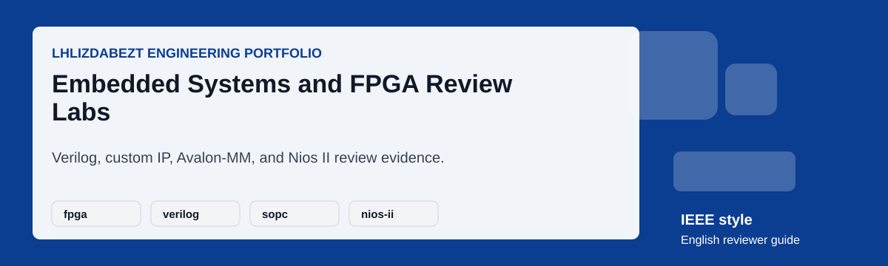

# Embedded Systems and FPGA Review Labs

## Executive Summary

This repository organizes FPGA and embedded systems review material around Quartus, Platform Designer, Verilog custom IP, Avalon-MM integration, PIO/timer/DMA-style lab topics, and Nios II C workflows. It is written for reviewers who want to see a coherent engineering learning record instead of isolated lab files.

## Project Snapshot

| Field | Details |
|---|---|
| Repository | [lhlizdabezt/embedded-systems-fpga-review-labs](https://github.com/lhlizdabezt/embedded-systems-fpga-review-labs) |
| Portfolio Track | FPGA, SoPC, Verilog custom IP, Avalon-MM, Nios II C, and lab review evidence |
| Public Status | Reviewer-ready English guide with release-backed evidence |
| Latest Release | [Open stable release](https://github.com/lhlizdabezt/embedded-systems-fpga-review-labs/releases/latest) |
| Owner Profile | [lhlizdabezt](https://github.com/lhlizdabezt) |
| Contact | 22207056@student.hcmus.edu.vn; luonghailong.work@gmail.com; Tel: +84988114708 |

## Reviewer Evidence Map

- Lab folders that preserve HDL, SoPC, and embedded C evidence.
- Reviewer notes that explain the connection between hardware blocks and software control.
- Release assets that make the repository readable from GitHub without local tooling.
- Public English documentation suitable for HR and engineering faculty review.

## Implementation Review Notes

| Review Point | What To Check |
|---|---|
| Problem framing | Confirm that the README explains the engineering purpose without exaggerated claims. |
| Technical evidence | Inspect the source folders, reports, scripts, schematics, or visual assets listed below. |
| Reproducibility | Use the local instructions where tools are available, or rely on the release snapshot for portfolio review. |
| Communication quality | Check headings, captions, tables, and release notes for clear English technical writing. |
| Professional boundary | Treat the repository as educational or portfolio evidence unless the source explicitly proves production deployment. |

## Repository Structure

| Path | Reviewer Purpose |
|---|---|
| `Bai*/` | Lab folders for FPGA, SoPC, or embedded-system review topics. |
| `assets/` | Motion preview and English reviewer card. |
| `docs/` | Supplemental diagrams or documentation when available. |
| `RELEASE_NOTES.md` | Release changelog for the English reviewer guide. |

## How To Review

- Use this README to understand the lab map before opening individual folders.
- Inspect HDL, Qsys or Platform Designer files, and Nios II C evidence by lab topic.
- Check the latest release for the reviewed public snapshot.
- Read the scope section to distinguish educational lab evidence from production FPGA IP.

## How To Use Or Inspect Locally

- Open the relevant lab folder in the matching Quartus environment.
- Inspect Verilog modules and SoPC system configuration before compiling.
- Use the C source or Nios II evidence to understand software-side register interaction.
- Treat board-specific steps as dependent on the available FPGA kit and lab setup.

## Visual Evidence

*Animated English reviewer card.*

## Release, Tags, And Topics

- Current release target: `reviewer-guide-2026-06-02`.
- Recommended topic set: `fpga, verilog, sopc, nios-ii, avalon-mm, quartus, platform-designer, embedded-systems, custom-ip, hardware-software`.
- Release notes are maintained in [`RELEASE_NOTES.md`](RELEASE_NOTES.md) for stable reviewer traceability.
- The release archive is intended for HR review, seminar evidence, and academic portfolio verification.

## Contact And Professional Links

| Channel | Link |
|---|---|
| GitHub | [https://github.com/lhlizdabezt](https://github.com/lhlizdabezt) |
| LinkedIn | [https://www.linkedin.com/in/lhlizdabezt](https://www.linkedin.com/in/lhlizdabezt) |
| Facebook | [https://www.facebook.com/wageseadrake](https://www.facebook.com/wageseadrake) |
| Instagram | [https://www.instagram.com/lhlizdabezt](https://www.instagram.com/lhlizdabezt) |
| YouTube | [https://www.youtube.com/@lhlizdabezt](https://www.youtube.com/@lhlizdabezt) |
| TikTok | [https://www.tiktok.com/@wageseadrake](https://www.tiktok.com/@wageseadrake) |
| Academic Email | [22207056@student.hcmus.edu.vn](mailto:22207056@student.hcmus.edu.vn) |
| Professional Email | [luonghailong.work@gmail.com](mailto:luonghailong.work@gmail.com) |
| Phone | [+84988114708](tel:+84988114708) |

## FAQ

| Question | Answer |
|---|---|
| Is this a single finished product? | No. It is a curated review repository for multiple FPGA and embedded-system lab topics. |
| What should engineering reviewers look for? | Signal-level reasoning, hardware/software interaction, module organization, and clear documentation. |
| Does it include confidential IP? | No. It is public coursework and review material. |

## Scope And Boundaries

- This repository is presented as public engineering portfolio evidence.
- Claims are intentionally limited to what the repository, report, source files, simulations, or visual assets can support.
- Public text is written in English (United States) for HR, faculty, and engineering reviewers.
- SVG text is kept ASCII-safe to reduce rendering errors, mojibake, and missing-glyph blocks.
- Motion visuals avoid moving dotted paths, curved connector lines, and text-over-line compositions.

## Writing Standard

The public README, release notes, captions, and reviewer-facing metadata are written in a restrained IEEE and Harvard-inspired style: concise, evidence-first, technically accurate, and suitable for Electronics and Telecommunications portfolio review.
