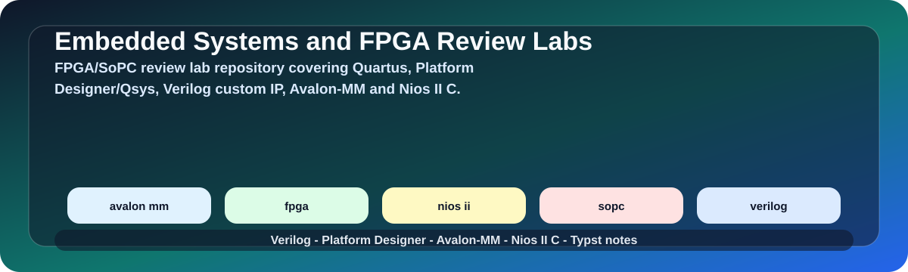

# FPGA and SoPC Review Labs

  
  
  

  

## Overview

This repository collects FPGA/SoPC lab evidence around Quartus, Platform Designer, Avalon-MM custom IP, Nios II C and peripheral integration.

| Field | Details |
|---|---|
| Repository | [embedded-systems-fpga-review-labs](https://github.com/lhlizdabezt/embedded-systems-fpga-review-labs) |
| Portfolio category | FPGA/SoPC lab and review repository |
| Primary stack | Verilog, Avalon-MM, Quartus, Platform Designer/Qsys, Nios II C, PIO, timer, DMA, Typst. |
| Latest release | [GitHub Releases](https://github.com/lhlizdabezt/embedded-systems-fpga-review-labs/releases/latest) |
| Tags | [Version tags](https://github.com/lhlizdabezt/embedded-systems-fpga-review-labs/tags) |
| Owner profile | [Luong Hai Long](https://github.com/lhlizdabezt) |

## Reviewer Map

| What to Review | Where to Look | Why It Matters |
|---|---|---|
| Technical scope | This README and source tree | Gives a quick, bounded reading path before opening every file |
| Evidence assets | Release page and top-level project files | Shows what can be downloaded or inspected quickly |
| Implementation material | Source folders, scripts, notebooks or design files | Connects the portfolio claim to real project artifacts |
| Version history | Tags and release notes | Makes the repository easier to audit over time |

## Evidence Highlights

- Verilog Avalon-MM custom IP and Platform Designer/Qsys integration.
- Nios II C, PIO, timer and DMA lab coverage.
- HEX display and hardware/software integration exercises.
- Typst notes and reviewer-oriented documentation.

## Repository Structure

| Path | Purpose |
|---|---|
| `assets/` | Top-level directory included in the repository |
| `Bai7/` | Top-level directory included in the repository |
| `Bai8_new/` | Top-level directory included in the repository |
| `de1/` | Top-level directory included in the repository |
| `de2/` | Top-level directory included in the repository |
| `DeCuongOnTap_HTNhung/` | Top-level directory included in the repository |
| `scripts/` | Top-level directory included in the repository |
| `DeCuong_OnTap_LuongHaiLong.pdf` | Top-level file included in the repository |

## Scope and Boundaries

Lab and review repository for learning and interview evidence; it is not a production FPGA IP library.

## Role and Portfolio Context

Luong Hai Long maintains this as structured FPGA/SoPC evidence in the engineering portfolio.

## Release and Tagging Notes

This repository is maintained as part of an English-facing engineering portfolio. Releases and tags are used to preserve reviewable snapshots of the project, including source state, documentation updates and any available visual or report assets.

## Writing Standard

The README follows an evidence-first style: direct technical nouns, clear project boundaries, release-backed artifacts and no inflated claims beyond what the repository can support.
