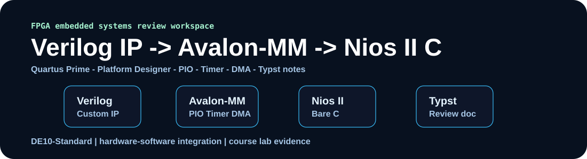
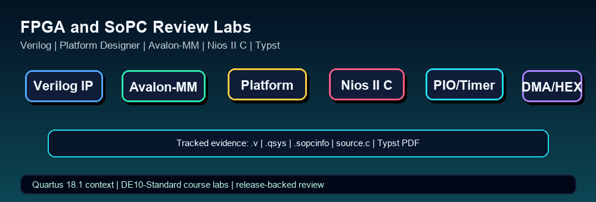

# Embedded Systems and FPGA Review Labs

<p align="center">
  <a href="https://github.com/lhlizdabezt/embedded-systems-fpga-review-labs/releases/latest"></a>
  <a href="https://github.com/lhlizdabezt/embedded-systems-fpga-review-labs/tags"></a>
  
  
</p>

<p align="center">
  
</p>

This repository collects FPGA and embedded-system coursework built around Verilog, Quartus Prime, Platform Designer/Qsys, Avalon memory-mapped peripherals, and Nios II C applications. It is a review archive rather than one production IP core.

## Evidence map

| Area | Checked-in evidence |
|---|---|
| HDL | Verilog top-level modules, seven-segment decoders, registers, switches, and custom peripherals |
| SoPC integration | `.qsys`, `.sopcinfo`, generated system wrappers, and component `_hw.tcl` files |
| Embedded software | Nios II C sources, makefiles, and application metadata |
| Board projects | Quartus `.qpf` and `.qsf` project files with DE10-Standard pin assignment evidence |
| Study material | Typst source and compiled PDF review notes |

## Lab map

| Path | Review focus |
|---|---|
| [`de1/`](de1) | Quartus project, DE10-Standard pin assignment, Platform Designer system, and Nios II timer application |
| [`Bai7/`](Bai7) | Verilog switch/HEX peripherals, component declarations, SoPC system, and timer-side C source |
| [`Bai8_new/`](Bai8_new) | Platform Designer system plus two Nios II application variants |
| [`de2/`](de2) | Multi-register Verilog design, custom component descriptors, SoPC integration, and C control code |
| [`DeCuongOnTap_HTNhung/`](DeCuongOnTap_HTNhung) | Typst review-note source and bibliography |
| [`DeCuong_OnTap_LuongHaiLong.pdf`](DeCuong_OnTap_LuongHaiLong.pdf) | Compiled review document |

## Hardware-software review path

```text
Verilog peripheral
    -> component _hw.tcl
    -> Platform Designer/Qsys system
    -> Avalon-MM address map
    -> generated Nios II system
    -> C register access
    -> board-visible output
```

<p align="center">
  
</p>

The animation summarizes the repository structure; compilation evidence must come from the matching Quartus project and generated system files.

## Toolchain

- Intel Quartus Prime Lite and Platform Designer/Qsys; generated metadata records Quartus 18.1.
- Nios II Software Build Tools for the included C applications.
- Typst 0.15 or later for the review document.
- A DE10-Standard board when reproducing board-level behavior.

Generated SoPC files are version-specific. Open one lab at a time in a compatible Quartus installation, inspect the device and pin assignments, regenerate the Platform Designer system if required, and build the matching Nios II application only after the hardware system succeeds.

## Build the review document

```powershell
typst compile --root . DeCuongOnTap_HTNhung/main.typ Embedded-Systems-FPGA-Review.pdf
```

The faculty-facing review material remains in Vietnamese. This README and all repository SVG labels use US English for public navigation without altering the submitted academic source.

## Review checklist

1. Match each C application to its `.sopcinfo` and Qsys system.
2. Verify base addresses and peripheral names before interpreting `IORD` or `IOWR` calls.
3. Review HDL reset, clock, register-width, and seven-segment assumptions.
4. Treat generated wrappers as tool output; inspect hand-written Verilog and C separately.
5. Recompile on the intended device before claiming timing closure or hardware validation.

## Scope

The repository demonstrates coursework-level hardware-software integration. It does not claim reusable production IP, formal verification, timing closure on every project, or compatibility with current Intel FPGA releases.

## FAQ

| Question | Answer |
|---|---|
| Is this one finished FPGA product? | No. It is a curated set of related labs and review notes. |
| Which files show the hardware-software boundary? | Start with the Verilog modules, `_hw.tcl` descriptors, `.qsys` systems, `.sopcinfo` maps, and corresponding C sources. |
| Can the projects be opened in a newer Quartus version? | Possibly, but migration can change generated IP and must be verified per project. |

<details>
<summary>Contact and professional links</summary>

| Channel | Link |
|---|---|
| GitHub | [lhlizdabezt](https://github.com/lhlizdabezt) |
| LinkedIn | [linkedin.com/in/lhlizdabezt](https://www.linkedin.com/in/lhlizdabezt) |
| Facebook | [facebook.com/wageseadrake](https://www.facebook.com/wageseadrake) |
| Instagram | [instagram.com/lhlizdabezt](https://www.instagram.com/lhlizdabezt) |
| YouTube | [youtube.com/@lhlizdabezt](https://www.youtube.com/@lhlizdabezt) |
| TikTok | [tiktok.com/@wageseadrake](https://www.tiktok.com/@wageseadrake) |
| Email | [22207056@student.hcmus.edu.vn](mailto:22207056@student.hcmus.edu.vn), [luonghailong.work@gmail.com](mailto:luonghailong.work@gmail.com) |
| Phone | [+84 988 114 708](tel:+84988114708) |

</details>
